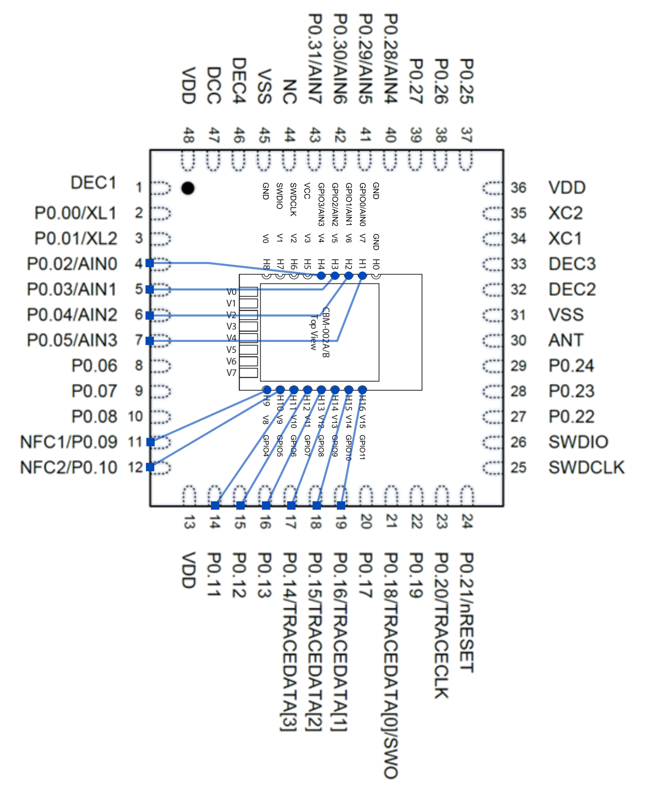

# Zephyr Configurations for CASAMBI CBM-002A/B Modules

Although it is stated that the chip inside the module supports Bluetooth 4.0, the modules I have actually houses an NRF52832_QFAAE1 SoC. According to [SoC Revisions and Variants](https://infocenter.nordicsemi.com/index.jsp?topic=%2Fcomp_matrix_nrf52832%2FCOMP%2Fnrf52832%2Fic_revision_overview.html), this nRF52832 rev2, in QFN48 package with 512kB of flash and 64kB of SRAM.

The modules expose SWDIO and SWDCLK pins, which makes reprogramming the MCU possible.
The nRF SoC inside the module has AP lock enabled but it can be easily unlocked by running nrf52_recover inside openOCD.

The pin mapping from the Casambi module to nRF52832 is relatively straightforward, as shown in the diagram below. None of the GPIO pins are located near the antenna.
The nRESET pin is not exposed and not needed for debugging and programming via the SWD interface.

The NFC pins are shared with GPIOs and the Casambi module has NFC enabled, which disables GPIO functionalities. To repurpose these two pins for GPIO, put CONFIG_NFCT_PINS_AS_GPIOS=y inside prj.conf. Removing this macro will not undo the change as the setting is written to the User Information Configuration Registers and is persistent inside NVM. Refer to nRF52832 datasheet for how to reverse the change.

The mapping between nRF52832 QFN48 and CASAMBI CBM-002A/B module is summarized below.

| nRF52832 | nRF Functions | Horizontal Pin | Vertical Pin | Casambi Pinout |
| :------: | :-----------: | :------------: | :----------: | -------------- |
|  GPIO-5  |     AIN3      |       H1       |      V7      | GPIO0/AIN0     |
|  GPIO-4  |     AIN2      |       H2       |      V6      | GPIO1/AIN1     |
|  GPIO-3  |     AIN1      |       H3       |      V5      | GPIO2/AIN2     |
|  GPIO-2  |     AIN0      |       H4       |      V4      | GPIO3/AIN3     |
|  GPIO-9  |     NFC1      |       H9       |      V8      | GPIO4          |
| GPIO-10  |     NFC2      |      H10       |      V9      | GPIO5          |
| GPIO-11  |               |      H11       |     V10      | GPIO6          |
| GPIO-12  |               |      H12       |     V11      | GPIO7          |
| GPIO-13  |               |      H13       |     V12      | GPIO8          |
| GPIO-14  | TRACEDATA[3]  |      H14       |     V13      | GPIO9          |
| GPIO-15  | TRACEDATA[2]  |      H15       |     V14      | GPIO10         |
| GPIO-16  | TRACEDATA[1]  |      H16       |     V15      | GPIO11         |

The pinout of the CBM-002A/B modules is provided below for convenience.

| Horizontal Pin | Vertical Pin | Casambi Pinout |
| :------------: | :----------: | :------------: |
|       H0       |      -       |      GND       |
|       H1       |      V7      |   GPIO0/AIN0   |
|       H2       |      V6      |   GPIO1/AIN1   |
|       H3       |      V5      |   GPIO2/AIN2   |
|       H4       |      V4      |   GPIO3/AIN3   |
|       H5       |      V3      |      VCC       |
|       H6       |      V2      |     SWDCLK     |
|       H7       |      V1      |     SWDIO      |
|       H8       |      V0      |      GND       |
|       H9       |      V8      |     GPIO4      |
|      H10       |      V9      |     GPIO5      |
|      H11       |     V10      |     GPIO6      |
|      H12       |     V11      |     GPIO7      |
|      H13       |     V12      |     GPIO8      |
|      H14       |     V13      |     GPIO9      |
|      H15       |     V14      |     GPIO10     |
|      H16       |     V15      |     GPIO11     |
